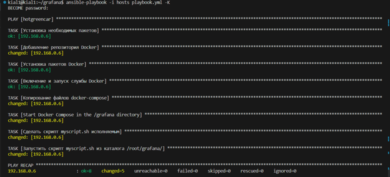
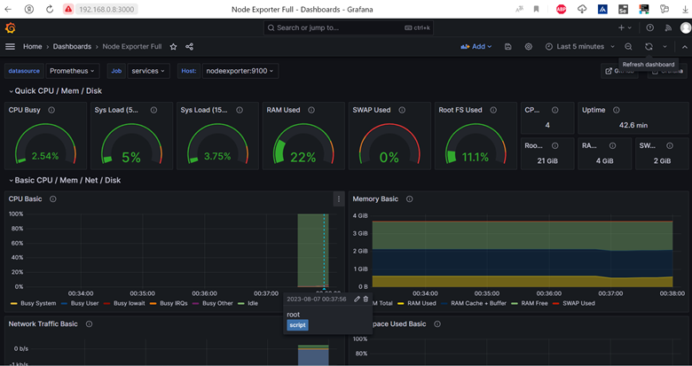

# Grafana+Prometheus with annotation
Ansible playbook мониторинг Grafana+Prometheus с отметками о запуске скрипта

## Установка

Чтобы начать установку, следуйте этим шагам:

1. **Клонирование репозитория:**
   ```bash
   git clone https://github.com/kial1Ekb/grafana
   
2. **Запуск playbook:**
    ```bash
   ansible-playbook -i hosts playbook.yml -K






